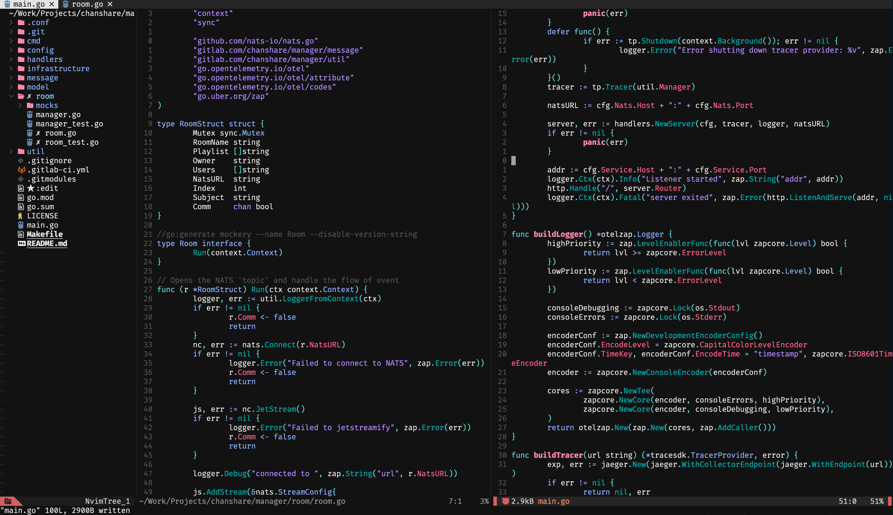

# My from scratch Neovim config

List of plugins used: 

* wbthomason/packer.nvim
* windwp/windline.nvim
* EdenEast/nightfox.nvim
* neovim/nvim-lspconfig
* williamboman/mason.nvim
* williamboman/mason-lspconfig.nvim
* mfussenegger/nvim-lint
* nvim-treesitter/nvim-treesitter
* lukas-reineke/lsp-format.nvim
* hrsh7th/nvim-cmp -- Autocompletion plugin
* hrsh7th/cmp-nvim-lsp -- LSP source for nvim-cmp
* saadparwaiz1/cmp_luasnip -- Snippets source for nvim-cmp
* L3MON4D3/LuaSnip -- Snippets plugin
* google/vim-maktaba
* google/vim-glaive
* google/vim-codefmt
* mfussenegger/nvim-dap
* onsails/lspkind.nvim
* folke/which-key.nvim
* nvim-telescope/telescope.nvim
* windwp/nvim-autopairs
* shaunsingh/oxocarbon.nvim
* glepnir/lspsaga.nvim
* leoluz/nvim-dap-go
* jose-elias-alvarez/null-ls.nvim
* kyazdani42/nvim-tree.lua
* noib3/nvim-cokeline

